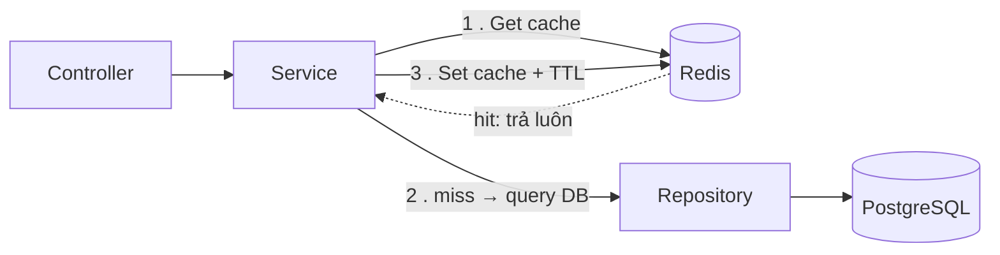
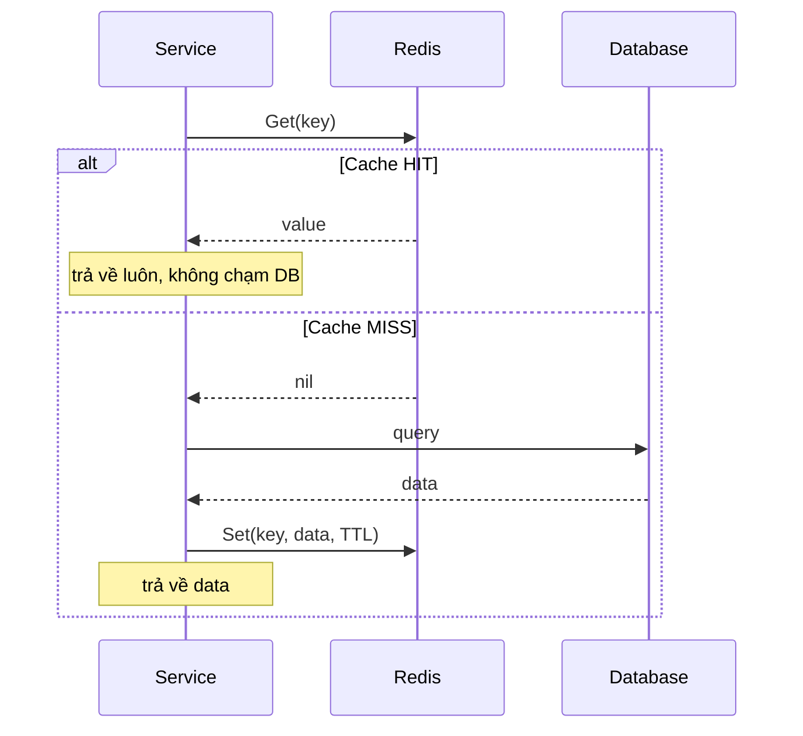
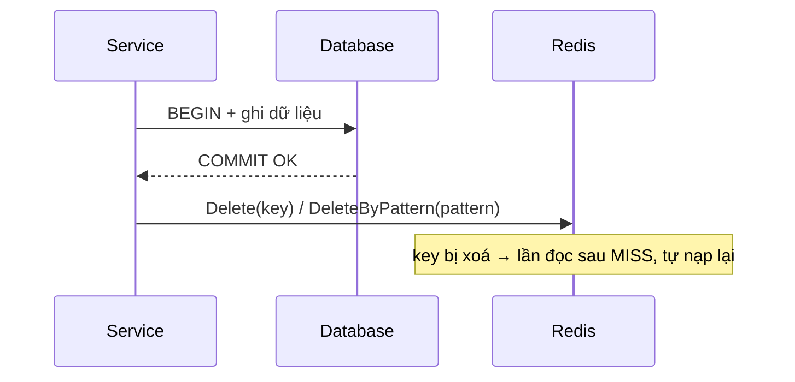

# Technical Design: Redis Cache

---

## 1. Mục tiêu & Vấn đề cần giải quyết

### 1.1 Vấn đề hiện tại
- Nhiều API đọc đi đọc lại cùng một dữ liệu **ít thay đổi** nhưng query DB mỗi request 
- Một số query nặng (JOIN nhiều bảng, COUNT, aggregate) lặp lại liên tục 
### 1.2 Mục tiêu 
- Xây **một lớp cache dùng chung**, type-safe (generics), dễ inject & test.
- Chuẩn hoá **key naming**, **TTL**, **serialize JSON**, **invalidation**.
- Pattern chủ đạo: **Cache-Aside** (lazy loading) — cache là lớp tăng tốc, **không phải nguồn sự thật**.
- Cache **không bao giờ làm chết request**: lỗi Redis → fallback xuống DB.

---

## 2. Tổng quan kiến trúc

Cache nằm ở **tầng Service**, xen giữa Service và Repository (Clean Architecture giữ nguyên):



- **Repository giữ thuần** (chỉ DB, không biết tới cache) — đúng convention hiện tại.
- **Service** quyết định cache cái gì, TTL bao lâu, khi nào invalidate.
- Lý do đặt ở Service: nó là nơi biết "nghiệp vụ" — biết dữ liệu nào đọc nhiều, đổi ít, và khi nào write làm dữ liệu cũ.

---

## 3. Cache-Aside Pattern 

**Đọc (Read):**
1. Build key → `Get` từ Redis.
2. **Hit** → unmarshal, trả về luôn (không chạm DB).
3. **Miss** → query DB → `Set` vào Redis kèm TTL → trả về.



**Ghi (Write / Update / Delete):**
1. Ghi DB (trong transaction như hiện tại).
2. Sau khi commit thành công → **invalidate** key liên quan (`Delete` / `DeleteByPattern`).
3. Lần đọc kế tiếp sẽ miss → tự nạp lại cache mới.



> Nguyên tắc: **ghi DB trước, xoá cache sau**. Không "update cache" trực tiếp khi write (dễ lệch khi transaction rollback). Xoá để lần sau nạp lại cho chắc.

---
  
## 4. Key Naming Convention  
  
Kế thừa quy ước đang có (`SERVICE_ENV_MODULE_...`), chuẩn hoá thành:  
  
```  
{SERVICE}:{ENV}:{MODULE}:{ENTITY}:{IDENTIFIER}  
```  
Ví dụ:  
| Mục đích | Key |  
| Detail role template id=14 | `PPC:STG:ROLE_TEMPLATE:DETAIL:14` |  
| Danh sách store của template 14 | `PPC:STG:ROLE_TEMPLATE:STORES:14` |  
| Permission của user 200 | `PPC:STG:USER:PERMISSION:200` |  
  
Quy tắc:  
- Dùng `:` phân tách (Redis convention, hỗ trợ nhóm key khi `SCAN`/`DEL` theo prefix).  
- `SERVICE`, `ENV` lấy từ env (`SERVICE`, `ENV`) — đã có sẵn.  
- Có hàm `BuildKey(...)` để **không ai tự nối chuỗi tay** → tránh đụng key / sai prefix.  
- Data **theo user** (quyền/cá nhân) dùng `BuildUserKey(userID, ...)` → key có `...:USER:{userID}:...`, tách cache riêng từng user, tránh rò rỉ data giữa các user.  
  
---  
  
## 5. Các hàm Redis dùng chung

Đề xuất expose qua **interface `Cache`** (inject vào service) thay vì biến global `rdb`.  
  
```go  
// Cache: các method thao tác trực tiếp với Redis (inject + mock được)  
type Cache interface {  
Get(ctx context.Context, key string, dest any) (bool, error)    Set(ctx context.Context, key string, value any, ttl time.Duration) error    Delete(ctx context.Context, keys ...string) error    DeleteByPattern(ctx context.Context, pattern string) error    Exists(ctx context.Context, key string) (bool, error)   Expire(ctx context.Context, key string, ttl time.Duration) error    TTL(ctx context.Context, key string) (time.Duration, error)}  
  
// --- Hàm độc lập (không thuộc interface) ---  
  
// BuildKey: ghép key chuẩn theo convention SERVICE:ENV:...  
func BuildKey(parts ...string) string  
  
// BuildUserKey: như BuildKey nhưng gắn userID vào key (cho data theo quyền/cá nhân)  
func BuildUserKey(userID int, parts ...string) string  
  
// Remember: generic wrapper cache-aside (đặt ngoài interface vì Go chưa cho method generic)  
func Remember[T any](ctx context.Context, c Cache, key string, ttl time.Duration, loader func() (T, error)) (T, error)  
  
// --- Giai đoạn sau (chưa làm ở Phase 1) ---  
  
// Lock: SetNX chống cache stampede  
// func Lock(ctx context.Context, key string, ttl time.Duration) (bool, error)  
```  
  
### Bảng ý nghĩa từng hàm  
  
| Hàm | Thuộc | Ý nghĩa | Giải quyết vấn đề gì |  
|---|---|---|---|  
| **`Get(ctx, key, dest) (bool, error)`** | Interface | Đọc key, unmarshal JSON vào `dest`. Trả `bool` = **hit/miss**. | Tách rõ 3 trạng thái: **hit** (có data), **miss** (`redis.Nil` → `false, nil`), **error** (Redis lỗi). Không nhầm "miss" với "lỗi" — chỗ này hay sai nhất. |  
| **`Set(ctx, key, value, ttl)`** | Interface | Marshal `value` ra JSON rồi lưu kèm **TTL**. | Ghi object (không chỉ string) vào cache; **TTL** đảm bảo dữ liệu tự hết hạn, tránh stale vĩnh viễn nếu lỡ quên invalidate. |  
| **`Delete(ctx, keys...)`** | Interface | Xoá 1 hoặc nhiều key cụ thể. | **Invalidation** khi update/delete entity. Variadic → xoá nhiều key liên quan trong 1 call. |  
| **`DeleteByPattern(ctx, pattern)`** | Interface | Quét bằng `SCAN` theo prefix rồi xoá cả nhóm. | Invalidate **cả cụm** key của 1 entity khi không biết hết key con (vd xoá `PPC:STG:ROLE_TEMPLATE:*:14`). **Dùng `SCAN`, KHÔNG dùng `KEYS`** (KEYS block toàn bộ Redis). |  
| **`Exists(ctx, key)`** | Interface | Kiểm tra key có tồn tại. | Check nhẹ không cần kéo cả value (vd kiểm tra đã cache chưa, hoặc làm cờ). |  
| **`Expire(ctx, key, ttl)`** | Interface | Đặt/đổi lại thời gian sống của key đang tồn tại. | Sliding expiration — gia hạn key khi nó vẫn đang được dùng, tránh hết hạn giữa lúc còn nóng. |  
| **`TTL(ctx, key)`** | Interface | Xem thời gian sống **còn lại** của key (`-1` = không có TTL, `-2` = không tồn tại). | Debug/observability cache; làm điều kiện cho `Expire` (sắp hết → gia hạn). |  
| **`BuildKey(parts ...string) string`** | Hàm độc lập | Ghép key chuẩn theo convention (`SERVICE:ENV:...`). | Tránh mỗi nơi tự nối chuỗi → sai prefix, đụng key, khó đổi format. Một chỗ duy nhất quản key. |  
| **`BuildUserKey(userID, parts...) string`** | Hàm độc lập | Như `BuildKey` nhưng nhúng `userID` vào key (vd `...:USER:200:...`). | Data **theo quyền/cá nhân** phải tách cache theo từng user → tránh user A thấy data của user B (rò rỉ); đồng thời chuẩn hoá vị trí `userID` trong key. |  
| **`Remember[T](ctx, c, key, ttl, loader)`** | Hàm độc lập (generic) | Cache-aside hoàn chỉnh: hit → trả cache; miss → gọi `loader()` (query DB) → set cache → trả. | **Hàm xương sống.** Gom toàn bộ pattern get-check-set vào 1 chỗ; service chỉ cần truyền `loader` là hàm query DB. Tránh lặp 10 dòng boilerplate ở mọi API. |  
| **`Lock(ctx, key, ttl)` (SetNX)** | Giai đoạn sau | Khoá ngắn hạn chống nhiều request cùng nạp 1 key. | Chống **cache stampede / dogpile**: khi 1 key hot hết hạn, hàng loạt request cùng miss và cùng đâm DB. |
**Lưu ý quan trọng về `context`:** luôn truyền `ctx` của request (`c.Request.Context()`) xuống, **không** dùng `context.Background()`

---

## 6. Nguyên tắc xử lý lỗi (rất quan trọng)

Cache là **best-effort**, không phải nguồn sự thật:

- `Get` lỗi Redis (không phải miss) → **log warning, coi như miss, query DB**. Không `PanicException`.
- `Set` lỗi → **log warning, bỏ qua**. Request vẫn trả data từ DB bình thường.
- Chỉ DB lỗi mới `PanicException` như hiện tại.

→ Redis chết thì hệ thống **chậm đi chứ không sập**.

---

## 7. Chiến lược TTL & Invalidation

| Loại dữ liệu | TTL gợi ý | Invalidate khi |
|---|---|---|
| Master/cấu hình ít đổi (role template, store list, market) | 5–30 phút | Có API update/delete entity đó |
| Dữ liệu user-scoped (permission, profile) | 1–5 phút | User đó được update quyền |
| Kết quả query nặng/aggregate | 30s–vài phút | Theo nghiệp vụ, hoặc để TTL tự lo |

Hai tầng bảo vệ stale:
1. **Chủ động**: write xong → `Delete` key.
2. **Bị động**: TTL hết hạn tự nạp lại (phòng khi quên invalidate ở đâu đó).

---

## 8. Ví dụ áp dụng (minh hoạ)

Cache detail role template với `Remember`:

```go
func (s *RoleTemplateServiceImpl) GetByID(c *gin.Context) {
    // ...validate id...
    key := redis.BuildKey("ROLE_TEMPLATE", "DETAIL", strconv.Itoa(roleTemplateID))

    data, err := redis.Remember(ctx, s.cache, key, 10*time.Minute,
        func() (dto.RoleTemplateDetailResp, error) {
            return s.buildRoleTemplateDetail(roleTemplateID) // toàn bộ query DB hiện tại gom vào đây
        },
    )
    // ...trả response...
}
```

Invalidate khi update:

```go
// sau khi transaction update commit thành công
_ = s.cache.DeleteByPattern(ctx, redis.BuildKey("ROLE_TEMPLATE", "*", strconv.Itoa(roleTemplateID)))
```

---

## 9. Đề xuất cấu trúc file

```
app/redis/
├── redis.go        // InitRedis (giữ), client + config
├── cache.go        // Cache interface + impl (Get/Set/Delete/DeleteByPattern/Exists)
├── remember.go     // Remember[T] generic
└── key.go          // BuildKey + hằng MODULE/ENTITY
```

Inject `Cache` vào service qua `wire`/constructor như các repository hiện tại.

---

OTP 
user gửi otp   