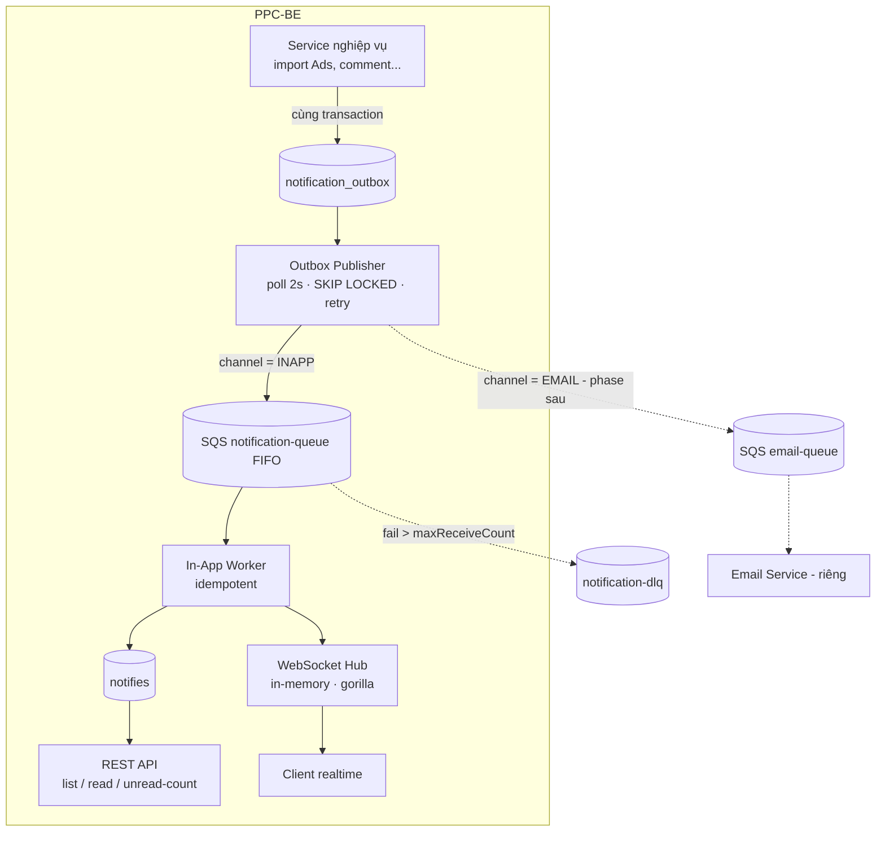
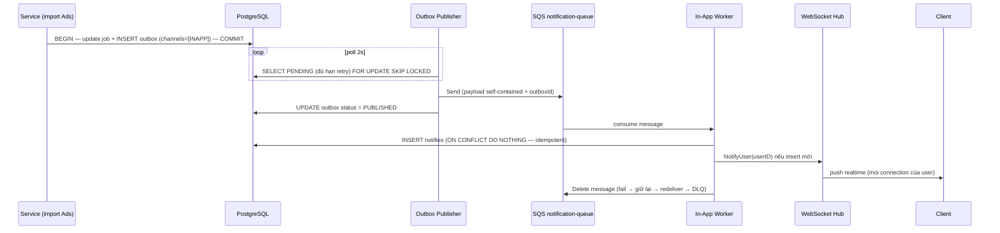
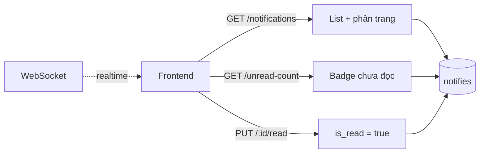
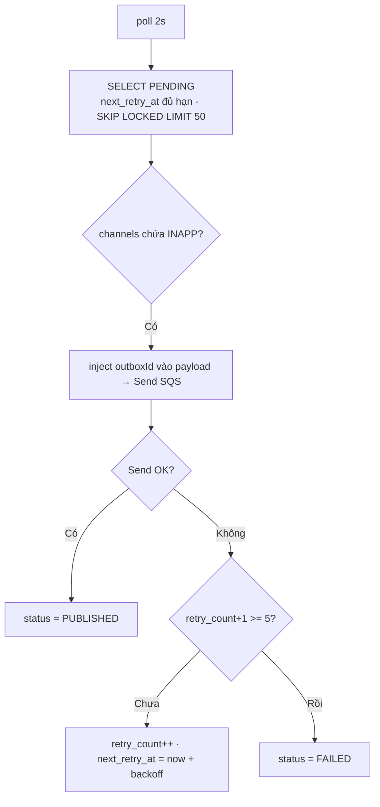
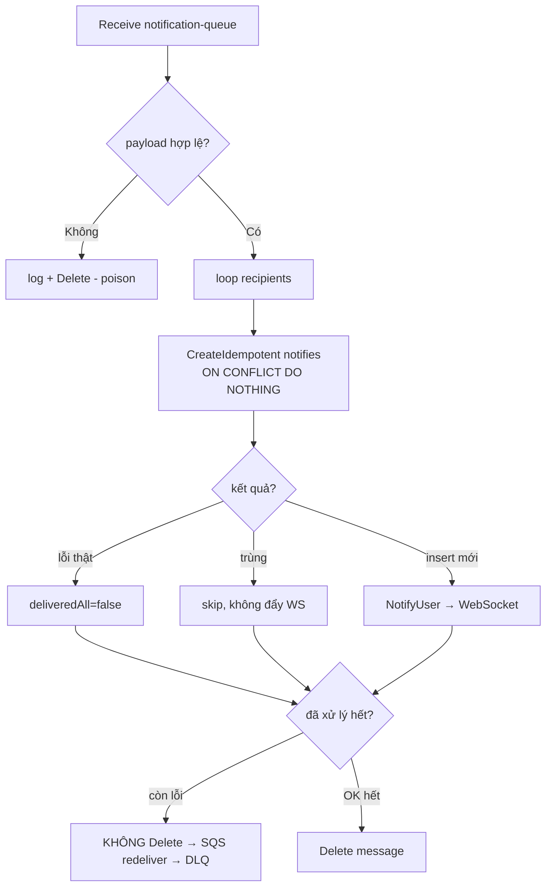
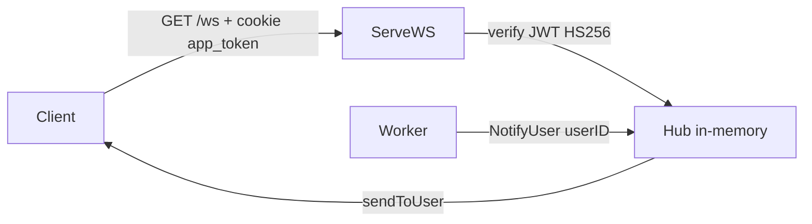

# TÀI LIỆU KỸ THUẬT — HỆ THỐNG NOTIFICATION (PPC TOOL)

> Trạng thái: Implemented (In-App) · Áp dụng: PPC-BE (Golang, GORM, PostgreSQL, AWS SQS, self-hosted WebSocket)
> Thiết kế: **Outbox Pattern + SQS + Worker + self-hosted WebSocket (in-memory Hub)**.
>
> **Phạm vi:**
> - **In-App notification** → module trong PPC-BE (**đã implement**).
> - **Email notification** → service riêng, cùng pattern Outbox+SQS (**phase sau**).

---

## 1. TỔNG QUAN

### 1.1. Mục tiêu
- Phân phối thông báo theo **sự kiện** trong PPC Tool cho **2 loại**:
    - **System / Process:** lỗi import Data Ads, đồng bộ Sellerboard failed, cron job...
    - **Business:** comment mới trên SKU, OpenPO tới hạn, FBA shipment thiếu...
- **In-App:** lưu DB (`notifies`) + đẩy **realtime qua WebSocket**; có API list / mark-read / unread-count.
- **Không mất thông báo:** **Outbox Pattern** (ghi event cùng transaction nghiệp vụ).
- **Không gửi trùng:** **Idempotency** phía worker (SQS at-least-once).
- **Tự phục hồi:** retry (publisher → outbox FAILED; worker → SQS redeliver → DLQ).

### 1.2. Giải pháp công nghệ
- **WebSocket self-hosted** ngay trong PPC-BE (`gorilla/websocket` + **Hub in-memory**), **KHÔNG** dùng AWS API Gateway, **KHÔNG** dùng Redis cho connection.
- **Outbox Pattern + AWS SQS (FIFO)**: producer ghi outbox → Publisher đẩy SQS → Worker tiêu thụ.
- **DLQ**: message xử lý fail quá ngưỡng → dead-letter queue.

> **Khác với thiết kế nháp ban đầu:** bỏ **API Gateway WebSocket + Redis connection-id** (vì phức tạp hạ tầng, không chạy local); In-App **cũng đi qua SQS + Worker** (đồng nhất pipeline với email, tách delivery khỏi request nghiệp vụ).

---

## 2. KIẾN TRÚC & LUỒNG

### 2.1. Sơ đồ tổng thể



**Phân tầng:**
1. **Producer (service nghiệp vụ):** chỉ ghi `notification_outbox` **trong cùng transaction** — không gửi trực tiếp.
2. **Publisher:** poll outbox `PENDING` → đẩy sang **SQS** (INAPP: notification-queue; EMAIL: email-queue) → mark `PUBLISHED` (fail → retry/FAILED).
3. **In-App Worker:** consume notification-queue → lưu `notifies` + đẩy **WebSocket** qua Hub.

### 2.2. Phân chia trách nhiệm

| Hạng mục | In-App (đã làm) | Email (phase sau) |
|---|---|---|
| Ghi outbox (producer) | x | x |
| Publisher → SQS | x | x |
| Worker consume SQS | x (notification-queue) | x (email-queue) |
| Lưu DB + realtime | `notifies` + WebSocket | deliveries + SES/SMTP |
| Idempotency | unique `(outbox_id,user_id)` | unique `(notification_id,recipient)` |
| Retry / DLQ | ✔ | ✔ |

### 2.3. Use Cases

**Luồng 1 — System event (In-App):**



**Luồng 2 — Business event (comment, chỉ In-App):**
- Service resolve **người nhận theo quyền** (owner SKU / leader / viewer) → `Recipients []int` → Emit outbox → pipeline như Luồng 1.

**Luồng 3 — User xem / đọc:**



---

## 3. THIẾT KẾ KỸ THUẬT

### 3.1. Database (đã implement)
```sql
-- Outbox: buffer event, ghi cùng transaction nghiệp vụ
CREATE TABLE notification_outbox (
  id            BIGSERIAL PRIMARY KEY,
  category      VARCHAR(20),      -- SYSTEM | BUSINESS
  event_type    VARCHAR(100),     -- DEMO_NOTIFY, ADS_SYNC_FAILED...
  channels      VARCHAR(50),      -- "INAPP" | "INAPP,EMAIL"
  aggregate_id  VARCHAR(100),
  payload       JSONB,            -- self-contained (recipients, title, message, outboxId...)
  status        VARCHAR(20) DEFAULT 'PENDING',  -- PENDING | PUBLISHED | FAILED
  retry_count   INT DEFAULT 0,
  next_retry_at TIMESTAMPTZ,      -- hẹn giờ thử lại (backoff)
  created_at    TIMESTAMPTZ DEFAULT now(),
  updated_at    TIMESTAMPTZ
);
CREATE INDEX idx_notification_outbox_status ON notification_outbox(status);
CREATE INDEX idx_outbox_pending_retry ON notification_outbox(status, next_retry_at);

-- In-App: TÁI DÙNG bảng notifies có sẵn, thêm cột
ALTER TABLE notifies ADD COLUMN is_read   BOOLEAN DEFAULT false;
ALTER TABLE notifies ADD COLUMN level     VARCHAR(20);
ALTER TABLE notifies ADD COLUMN title     VARCHAR(255);
ALTER TABLE notifies ADD COLUMN category  VARCHAR(20);
ALTER TABLE notifies ADD COLUMN outbox_id BIGINT;      -- nguồn từ outbox (idempotency)

CREATE INDEX idx_notifies_user_unread ON notifies(user_id, is_read, created_at DESC);
-- Idempotency: 1 outbox event → 1 notify/user (notify cũ outbox_id NULL bỏ qua)
CREATE UNIQUE INDEX idx_notifies_outbox_user ON notifies(outbox_id, user_id) WHERE outbox_id IS NOT NULL;
```
> Không tạo bảng `notifications` mới — **tái dùng `notifies`** (đã có, dùng chung với comment/pr_shipment). FK `fk_notifies_*` bị **drop** để notify hệ thống (created_id=0, không có user thật) không vi phạm ràng buộc.

### 3.2. Publisher (Outbox → SQS) — có retry

- **Không mark PUBLISHED trước khi Send** — chỉ mark sau khi SQS nhận (tránh mất message).
- **Backoff exponential**: 1m → 2m → 4m... cap 1h. Quá 5 lần → `FAILED`.
- **`injectOutboxID`**: gắn `outbox.id` vào payload lúc gửi SQS (id chưa có lúc Emit) → worker dùng cho idempotency. Không update lại outbox.payload.

### 3.3. In-App Worker (SQS → DB + WebSocket) — idempotent + DLQ

- **Idempotency**: `ON CONFLICT DO NOTHING` theo `(outbox_id, user_id)` → redeliver không tạo/đẩy WS trùng.
- **Retry/DLQ**: fail thật → **không Delete** → SQS redeliver sau visibility timeout → quá `maxReceiveCount` → **DLQ**.
- Chạy khi `ENABLE_QUEUE=TRUE`.

### 3.4. WebSocket self-hosted (thay AWS API Gateway)
- **Hub in-memory**: `map[userID] → tập *Client` (mutex). Mỗi Client giữ `userID/roleID/userPermissionID` + `send chan []byte`.
- **`ServeWS`** (`GET /ws`): upgrade WebSocket → auth bằng **cookie `app_token`** (JWT HS256, custom claims, verify signing method) → register vào Hub → chạy `readPump`/`writePump`.
- **Heartbeat**: `writePump` gửi **ping định kỳ (~54s)**, `readPump` xử lý pong → giữ connection sống.
- **Multi-device**: 1 user nhiều tab → Hub lưu Set connection → `NotifyUser` đẩy tới **mọi** connection.
- **CheckOrigin**: chỉ cho origin dev/stag/prod.
- **Graceful shutdown**: `main` nhận SIGINT/SIGTERM (signal context) → `websocket.Shutdown()` đóng toàn bộ client + HTTP/gRPC graceful stop.
- **Bắn**: `NotifyUser(userID, from, message)` → `hub.sendToUser` → ghi vào `send` channel → `writePump` ghi ra socket.



### 3.5. SQS payload (self-contained)
```json
{
  "outboxId": 7,
  "recipients": [1, 112],
  "category": "SYSTEM",
  "type": "ADS_SYNC_FAILED",
  "level": "error",
  "title": "Import Data Ads failed",
  "message": "..."
}
```
> Worker không query ngược — payload đủ để tạo `notifies` + đẩy WebSocket. `outboxId` để idempotency.

### 3.6. Email Service (phase sau)
Cùng pattern: Publisher đẩy `channel=EMAIL` sang **email-queue** → Email Service (riêng) consume → render template + gửi SES/SMTP → `deliveries` + idempotency `(notification_id, recipient)` + retry/DLQ. Chưa implement.

---

## 4. ĐỘ TIN CẬY & GIÁM SÁT
- **Không mất**: Outbox ghi cùng transaction; publisher retry (next_retry_at → FAILED).
- **Không trùng**: unique `(outbox_id, user_id)` + `ON CONFLICT DO NOTHING`.
- **Async**: nghiệp vụ chỉ ghi outbox rồi đi tiếp; gửi chạy nền.
- **Fault tolerance**: worker fail → SQS redeliver → DLQ; WebSocket offline → vẫn còn `notifies` để xem qua API.
- **Graceful shutdown**: đóng WS client + dừng publisher/worker theo context khi SIGTERM.
- **DLQ monitoring**: CloudWatch alarm `ApproximateNumberOfMessagesVisible > 0` trên DLQ → cảnh báo.
- **Stress test**: `tools/wsstress` (mở N connection + bắn hàng loạt, đo msgsRecv/drop).

---

## 5. ƯU / NHƯỢC & RỦI RO

### 5.1. Ưu điểm
- **Đơn giản hạ tầng**: WebSocket self-hosted (không API Gateway/Redis) → chạy được local + prod, ít cấu hình.
- **Bền**: Outbox + SQS + retry + DLQ → không mất event, tự phục hồi.
- **Không trùng**: idempotency phía worker.
- **Tách delivery khỏi nghiệp vụ**: nghiệp vụ chỉ ghi outbox; publisher/worker độc lập.

### 5.2. Rủi ro & biện pháp
| Rủi ro | Biện pháp |
|---|---|
| Dual-write (mất event khi gửi fail) | **Outbox** ghi cùng transaction + publisher retry |
| SQS at-least-once → trùng | **Idempotency** `(outbox_id, user_id)` |
| Nhiều publisher lấy trùng | `FOR UPDATE SKIP LOCKED` |
| Poison message (data lỗi, vd title>255) | fail → DLQ (nên thêm phân loại non-retryable + validate/truncate) |
| **WebSocket multi-instance** | Hub in-memory chỉ đúng **1 instance**; scale ngang cần **Redis Pub/Sub** fan-out |
| WS chết / offline | best-effort; bản ghi `notifies` là nguồn sự thật |
| Outbox phình to | job dọn record `PUBLISHED` cũ |

### 5.3. Giới hạn hiện tại (roadmap)
- **1 instance** cho WebSocket (Hub in-memory). Multi-instance → thêm Redis Pub/Sub.
- **Non-retryable handling**: title>255 hiện retry oan tới DLQ → nên validate/truncate + phân loại lỗi.
- **API list/mark-read/unread-count**: theo mục 2.3 Luồng 3 (bổ sung nếu chưa đủ).
- **Email Service**: chưa implement (phase sau, cùng pattern).
- **Notify theo role/group**: Client đã lưu `roleID/userPermissionID`; có thể thêm `sendToRole` hoặc resolve → userIDs ở service.

---

## 6. ENV & VẬN HÀNH
```bash
ENABLE_QUEUE=TRUE
NOTIFICATION_QUEUE=https://sqs.<region>.amazonaws.com/<acc>/PPC_NOTIFICATION_QUEUE.fifo
AWS_ACCESS_KEY / AWS_SECRET_KEY   # sqs:Send/Receive/DeleteMessage
SECRET_KEY                        # verify JWT app_token (WS auth)
# WebSocket self-hosted → KHÔNG cần WS_CALLBACK / API Gateway / Redis-connection nữa
```
- FE connect: `wss://<domain>/ws` (cookie `app_token` tự gửi). Reverse proxy phải forward header `Upgrade`/`Connection`.
- DLQ: tạo `*_DLQ.fifo` riêng + redrive policy (maxReceiveCount=5) trên queue chính.
