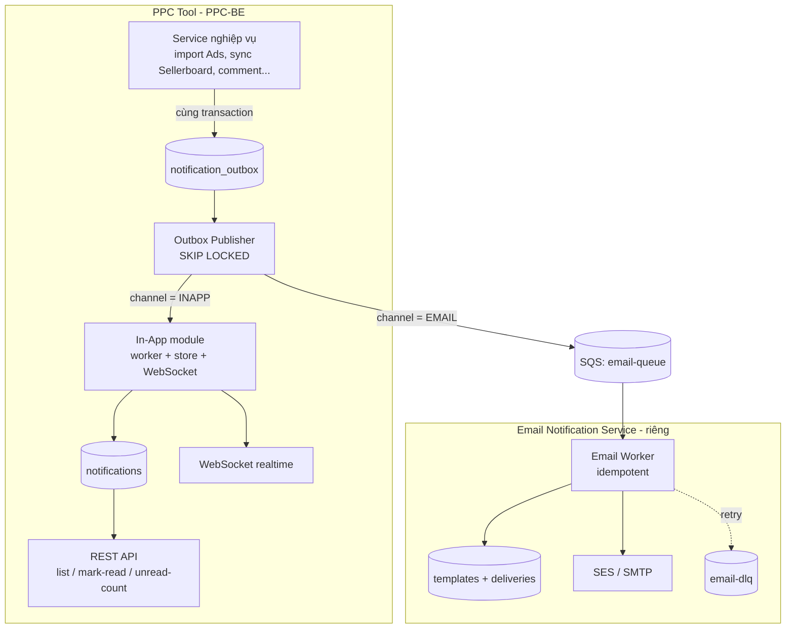
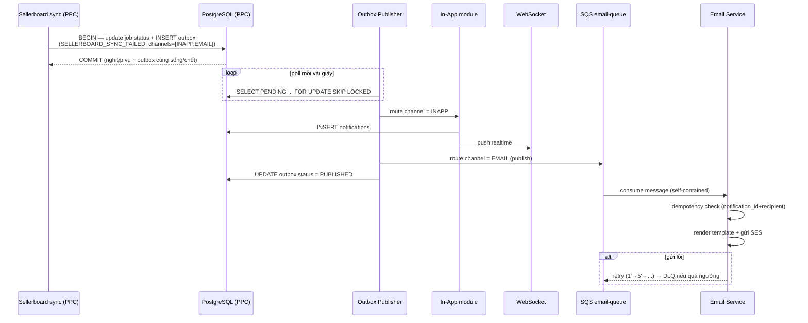
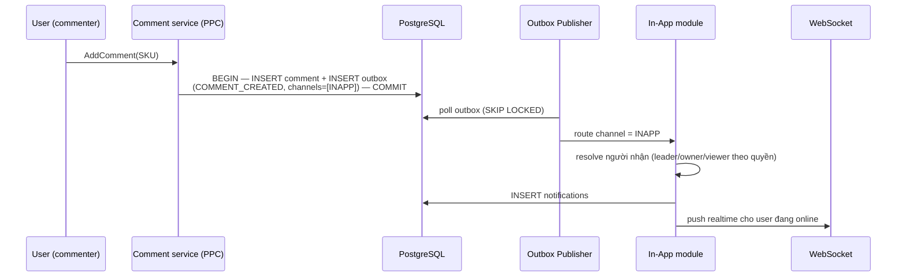
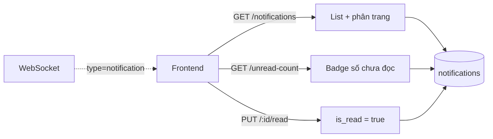
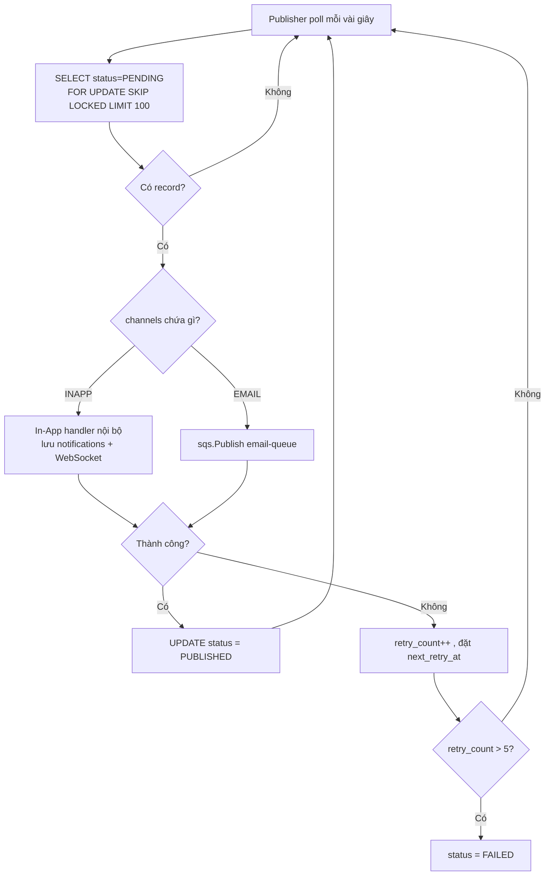
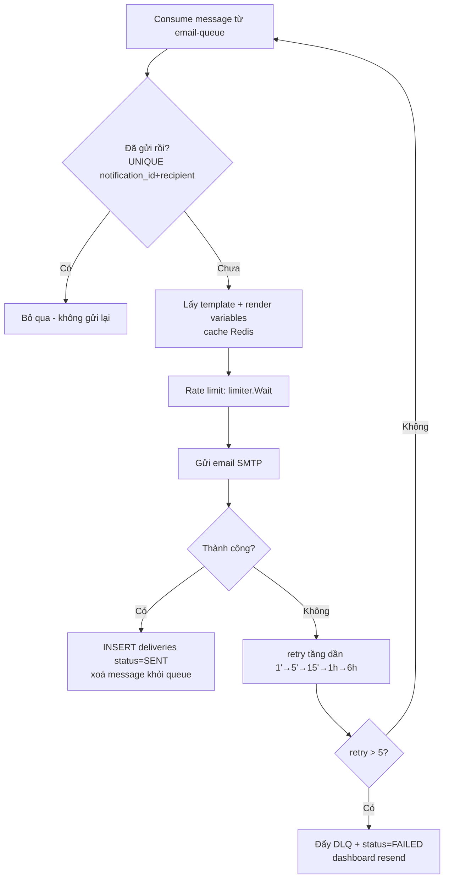

# TÀI LIỆU ĐỀ XUẤT KỸ THUẬT — HỆ THỐNG NOTIFICATION (PPC TOOL)

> Trạng thái: Draft · Áp dụng: PPC-BE (Golang, GORM, PostgreSQL, SQS, WebSocket, Redis)
> Tham chiếu thiết kế: Notification Platform Design (Outbox + SQS + Workers), Ví dụ Outbox Pattern.
>
> **Phạm vi:**
> - **In-App notification** → **module bên trong PPC Tool**.
> - **Email notification** → **service riêng **; PPC  **phát sự kiện** sang.

---

## 1. TỔNG QUAN DỰ ÁN

### 1.1. Mục tiêu
- Thu thập → xử lý → phân phối thông báo dựa trên **sự kiện** trong PPC Tool, cho **2 loại**:
  - **System / Process:** *đồng bộ Ads hoàn tất*, *lỗi đồng bộ Sellerboard*, import Plan/KDP done/failed, cron job...
  - **Business:** comment mới trên SKU, OpenPO tới hạn, FBA shipment thiếu số lượng...
- **In-App (trong PPC):** lưu DB + đẩy **realtime (WebSocket)**, có API list / mark-read / unread-count.
- **Email (service riêng):** PPC phát event sang Email Service; service đó render template + gửi email, có retry/DLQ, delivery tracking.
- **Không mất thông báo** (đặc biệt email — qua biên service): dùng **Outbox Pattern**.
- **Không gửi trùng:** **Idempotency** phía consumer (at-least-once của SQS).

### 1.2. Giải pháp công nghệ đề xuất
- **PPC-BE (In-App module):** Golang + GORM + PostgreSQL; realtime qua **WebSocket** (`websocket.NotifyUser`, AWS API Gateway + Redis connection-id).
- **Tích hợp PPC ↔ Email Service:** **Outbox Pattern** + **AWS SQS** (`email-queue`). PPC ghi outbox cùng transaction nghiệp vụ → Publisher đẩy SQS → Email Service tiêu thụ.
- **Email Service :**  gửi email qua **SMTP**, có **Retry + DLQ**, **Idempotency**, **rate limit**, **template + Redis cache**.

> **Right-size:** tài liệu tham chiếu cho quy mô triệu user (Firebase Push, SMS, multi-tenant) — PPC

---

## 2. KIẾN TRÚC HỆ THỐNG VÀ LUỒNG HOẠT ĐỘNG

### 2.1. Sơ đồ kiến trúc tổng thể



**Phân tầng:**
1. **Producer (PPC service):** chỉ ghi **outbox** trong cùng transaction — không tự gửi.
2. **Router/Publisher (PPC):** đọc outbox → định tuyến theo kênh:
   - `INAPP` → xử lý **trong PPC** (lưu `notifications` + WebSocket).
   - `EMAIL` → đẩy **SQS** cho **Email Notification**. 
3. **Email Service :** consume SQS → render + gửi email → tracking + retry/DLQ.

### 2.2. Phân chia trách nhiệm

| Hạng mục                           | In-app Notification | Email Notification |
| ---------------------------------- | ------------------- | ------------------ |
| Phát sự kiện                       | x ghi outbox        | —                  |
| In-App + realtime (WebSocket)      | x                   | —                  |
| Lưu `notifications`, API mark-read | x                   | —                  |
| Outbox + Publisher                 | x                   | —                  |
| Nhận event email (SQS)             | —                   | x                  |
| Template email + render            | —                   | x                  |
| Gửi email (SES/SMTP)               | —                   | x                  |
| Retry / DLQ / idempotency email    | —                   | x                  |
| Delivery tracking email            | —                   | x                  |

> **Hợp đồng (contract)** giữa 2 hệ thống = **message trên SQS** (mục 3.4). PPC không biết Email Service gửi thế nào; Email Service không biết PPC sinh event ra sao → **không phụ thuộc lẫn nhau**.

### 2.3. Chi tiết luồng nghiệp vụ (Use Cases)

**Luồng 1 — System event  ( In-App + Email):**


**1. `Job → DB: BEGIN — update job status + INSERT outbox`**  
Job sync lỗi → mở **1 transaction** làm **2 việc cùng lúc**: cập nhật trạng thái job (failed) **và** ghi 1 event vào `notification_outbox` (`event_type=SELLERBOARD_SYNC_FAILED`, `channels=[INAPP, EMAIL]`).

**2. `DB → Job: COMMIT (cùng sống/chết)`**  
Commit transaction → nghiệp vụ và event **cùng thành công hoặc cùng thất bại**. Đây là điểm cốt lõi của **Outbox**: không có chuyện "job ghi nhận lỗi nhưng event báo bị mất".

**3. `loop ... Pub → DB: SELECT PENDING ... FOR UPDATE SKIP LOCKED`**  
Publisher **chạy nền, poll mỗi vài giây**, lấy các event `PENDING`. `FOR UPDATE SKIP LOCKED` để nếu có nhiều publisher thì **không lấy trùng** record.

**4. `Pub → InApp: route channel = INAPP`**  
Event này có kênh `INAPP` → Publisher đưa cho In-App module xử lý.

**5. `InApp → DB: INSERT notifications`**  
In-App **lưu bản ghi `notifications` TRƯỚC** (đây là nguồn sự thật — để WS chết vẫn không mất).

**6. `InApp → WS: push realtime`**  
Rồi mới **đẩy WebSocket** cho user đang online (best-effort; offline thì thôi, đã có DB).

**7. `Pub → Q: route channel = EMAIL (publish)`**  
Event cũng có kênh `EMAIL` → Publisher **publish sang SQS `email-queue`** (ra khỏi PPC, sang Email Service).

**8. `Pub → DB: UPDATE outbox status = PUBLISHED`**  
Xử lý xong cả 2 kênh → đánh dấu event đã phát (`PUBLISHED`) để **không xử lý lại**.

**9. `Q → Email: consume message (self-contained)`**  
Email Service nhận message — message **tự chứa đủ** (recipients, template_code, variables) → **không cần query ngược PPC**.

**10. `Email → Email: idempotency check (notification_id + recipient)`**  
Trước khi gửi, kiểm tra đã gửi chưa (SQS có thể giao trùng) → tránh **gửi email lặp**.

**11. `Email → Email: render template + gửi SES`**  
Lấy template theo `template_code`, render với variables → gửi qua SES/SMTP → ghi `deliveries`.

**12. `alt gửi lỗi: Email → Q: retry → DLQ`**  
Nếu gửi thất bại → **retry tăng dần** (1'→5'→15'...); quá ngưỡng → đẩy **DLQ** để xử lý sau / resend.

**Luồng 2 — Business event (chỉ In-App):**


**1. `U → SVC: AddComment(SKU)`**  
User gửi comment lên 1 SKU → gọi API → vào Comment service.

**2. `SVC → DB: BEGIN — INSERT comment + INSERT outbox — COMMIT`**  
Trong **1 transaction**: vừa lưu **comment**, vừa ghi **event** vào `notification_outbox` (`COMMENT_CREATED`, `channels=[INAPP]`). Commit → comment và event **cùng sống/chết** (Outbox: comment lưu được thì event chắc chắn có).  
→ Khác Luồng 1: ở đây `channels` **chỉ `[INAPP]`** (comment không gửi email).

**3. `Pub → DB: poll outbox (SKIP LOCKED)`**  
Publisher chạy nền, lấy event `PENDING` (SKIP LOCKED để nhiều publisher không lấy trùng).

**4. `Pub → InApp: route channel = INAPP`**  
Event chỉ có kênh in-app → đưa cho In-App module. (Không có nhánh đẩy SQS email như Luồng 1.)

**5. `InApp → InApp: resolve người nhận (leader/owner/viewer theo quyền)`**  
Đây là bước **"nở 1 event ra N người nhận"** (đã giải thích ở câu trước): dựa role người comment + quyền sở hữu SKU → tính ra danh sách user cần nhận (owner SKU, leader, viewer). **Không bắn cho tất cả.**

**6. `InApp → DB: INSERT notifications`**  
Với mỗi người nhận → lưu 1 bản ghi `notifications` (nguồn sự thật, để xem qua API + WS chết vẫn còn).

**7. `InApp → WS: push realtime cho user đang online`**  
Đẩy WebSocket cho những người nhận **đang mở tool** → thấy ngay (best-effort; offline thì thôi, đã có DB).

**Luồng 3 — User xem / đánh dấu đã đọc (In-App):**



---

## 3. KẾ HOẠCH TRIỂN KHAI VÀ THIẾT KẾ KỸ THUẬT

### 3.1. PPC-BE — Database
```sql
-- Outbox: ghi cùng transaction nghiệp vụ (đảm bảo không mất event email)
CREATE TABLE notification_outbox (
  id           UUID PRIMARY KEY,
  category     VARCHAR(20),    -- SYSTEM | BUSINESS
  event_type   VARCHAR(100),
  channels     VARCHAR(50),    -- "INAPP", "EMAIL", "INAPP,EMAIL"
  aggregate_id VARCHAR(100),
  payload      JSONB,          -- self-contained
  status       VARCHAR(20) DEFAULT 'PENDING', -- PENDING|PUBLISHED|FAILED
  retry_count  INT DEFAULT 0,
  next_retry_at TIMESTAMP,
  created_at   TIMESTAMP DEFAULT now()
);
CREATE INDEX idx_outbox_pending ON notification_outbox(status, next_retry_at);

-- In-App notifications (mở rộng từ model Notify hiện có)
CREATE TABLE notifications (
  id BIGSERIAL PRIMARY KEY,
  user_id INT NOT NULL, actor_id INT,
  category VARCHAR(20), type VARCHAR(100), level VARCHAR(20),
  title TEXT, message TEXT,
  entity_type VARCHAR(50), entity_id VARCHAR(100),
  is_read BOOLEAN DEFAULT false, read_at TIMESTAMP,
  metadata JSONB, created_at TIMESTAMP DEFAULT now()
);
CREATE INDEX idx_notifications_user ON notifications(user_id, is_read, created_at DESC);
```

### 3.2. PPC-BE — Outbox & Publisher
- Producer ghi outbox cùng transaction (KHÔNG gọi gửi trực tiếp → tránh dual-write).



### 3.3. PPC-BE — In-App module
- Lưu `notifications` (resolve người nhận theo quyền) + `websocket.NotifyUser`.
- API: `GET /notifications?page&isRead`, `GET /notifications/unread-count`, `PUT /notifications/:id/read`, `PUT /read-all`.
- Realtime: thêm message type `notification` để FE cập nhật badge ngay.

### 3.4. Hợp đồng tích hợp PPC ↔ Email Service (SQS message)
**Message phải self-contained** (Email Service không query ngược PPC):
```json
{
  "notification_id": "uuid",          // = outbox id, dùng cho idempotency
  "template_code": "SELLERBOARD_SYNC_FAILED",
  "recipients": ["a@cty.com", "ops@cty.com"],
  "variables": { "store": "Store A", "error": "timeout", "time": "..." }
}
```
> PPC chịu trách nhiệm **resolve email người nhận** và **đưa đủ biến**; Email Service chỉ render + gửi.

### 3.5. Email Service — thiết kế
- **DB:** 
```sql 
-- Template email (render bằng html/template, cache Redis)
CREATE TABLE templates (
  id         UUID PRIMARY KEY,
  code       VARCHAR(100) NOT NULL,   -- = event_type, vd SELLERBOARD_SYNC_FAILED
  channel    VARCHAR(20)  NOT NULL,   -- EMAIL (nếu có nhiều kênh)
  subject    TEXT,                    --titel email có thể chứa biến {{store}}...
  content    TEXT NOT NULL,           --body email , dùng {{variables}}
  created_at TIMESTAMP DEFAULT now(),
  updated_at TIMESTAMP DEFAULT now()
);
-- 1 code chỉ 1 template cho mỗi channel
CREATE UNIQUE INDEX idx_templates_code_channel ON templates(code, channel);

-- Delivery tracking + idempotency (chống gửi trùng)
CREATE TABLE deliveries (
  id              BIGSERIAL PRIMARY KEY,
  notification_id UUID         NOT NULL,   -- = outbox id từ PPC (trace + idempotency)
  recipient       VARCHAR(255) NOT NULL,   -- email người nhận
  status          VARCHAR(20)  NOT NULL,   -- SENT | FAILED
  error           TEXT,                    -- lý do lỗi (nếu FAILED)
  retry_count     INT DEFAULT 0,
  created_at      TIMESTAMP DEFAULT now()
);
-- Idempotency: 1 (notification_id, recipient) chỉ gửi 1 lần
-- SQS at-least-once → vướng index này thì bỏ qua, không gửi lại
CREATE UNIQUE INDEX idx_deliveries_unique ON deliveries(notification_id, recipient);
```
- **Idempotency:** `UNIQUE(notification_id, recipient)` — SQS at-least-once → bỏ qua nếu đã gửi.
- **Render:** `html/template` từ `templates`, cache Redis (`template:{code}`, TTL ~30').
- **Gửi:** SES (hoặc SMTP). **Rate limit** token-bucket (`golang.org/x/time/rate`) tránh bị provider block khi gửi lượng lớn.
- **Retry:** 1'→5'→15'→1h→6h; quá 5 lần → **DLQ** (`email-dlq`) + dashboard resend.
- **Monitoring:** `email_sent_total`, `email_failed_total`, `email_retry_total`.



---

## 4. PHƯƠNG ÁN HẠ TẦNG, ĐỘ TIN CẬY & GIÁM SÁT
- **Không mất notify:** Outbox (PPC) ghi cùng transaction → email event chắc chắn được phát dù SQS publish tạm lỗi (retry).
- **Không trùng:** Idempotency phía In-App (unique theo outbox+user+channel) và phía Email Service (unique theo notification_id+recipient).
- **Async, không chặn nghiệp vụ:** import/cron chỉ ghi outbox rồi đi tiếp; gửi chạy nền.
- **Fault tolerance:** Retry + DLQ (email); WebSocket offline vẫn còn bản ghi `notifications` để xem qua API.
- **Bảo mật biên service:** message SQS không chứa secret; xác thực truy cập SQS bằng IAM; email người nhận do PPC cấp.

---

## 5. ĐÁNH GIÁ ƯU - NHƯỢC ĐIỂM & RỦI RO

### 5.1. Ưu điểm
- **Tách trách nhiệm rõ:** In-App gắn PPC (cần context/quyền/realtime); Email tách riêng → **tái dùng được cho hệ thống khác** sau này, scale/deploy độc lập.
- **Decoupled qua SQS contract:** đổi cách gửi email không ảnh hưởng PPC.
- **Không mất / không trùng** (Outbox + Idempotency).
- **Tận dụng hạ tầng sẵn có** (SQS, WebSocket, Redis, Prometheus).

### 5.2. Rủi ro và biện pháp
| Rủi ro                                     | Biện pháp                                         |
| ------------------------------------------ | ------------------------------------------------- |
| Dual-write (mất email khi publish fail)    | **Outbox** ghi cùng transaction + Publisher retry |
| SQS at-least-once → trùng                  | **Idempotency** 2 phía                            |
| Nhiều publisher lấy trùng record           | `FOR UPDATE SKIP LOCKED`                          |
| Email Service down                         | SQS giữ message + retry; DLQ khi quá ngưỡng       |
| Outbox phình to                            | Job dọn record `PUBLISHED` cũ                     |
| Lẫn `Message`(progress) với `Notification` | Tách bạch vai trò                                 |

---


